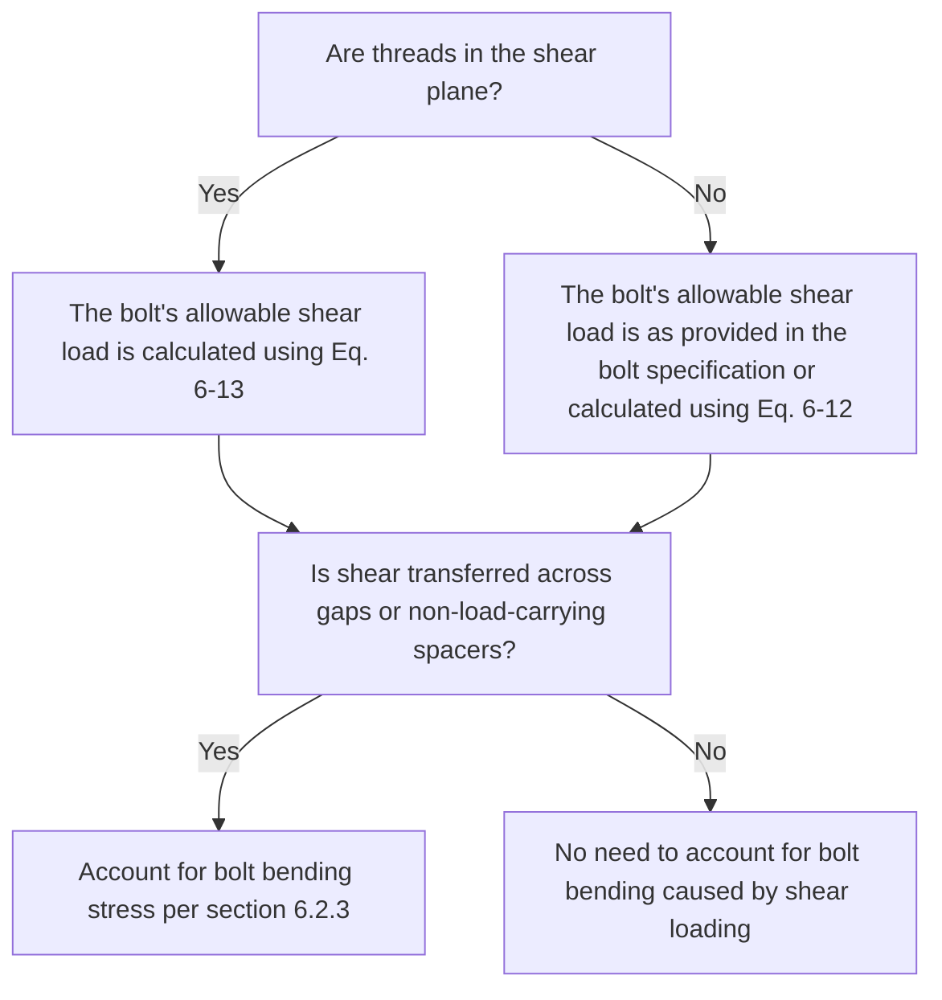

#This is an excerpt from NASA 5020 relevant to the analysis of bolted joints. (Section 6)

## 6. CRITERIA FOR ANALYSIS OF THREADED FASTENING SYSTEMS

This section applies to analysis of a threaded fastening system based on the assumption that the applied load acting on that fastening system is known or is adequately predicted. The analysis performed to determine how applied loads distribute between fasteners is outside the scope of this document. Appendix A provides technical rationale for selected analysis criteria in this section. The analysis criteria herein apply only to fasteners made of ductile metallic materials. Analysis of threaded fasteners made of brittle or nonmetallic materials should be based on test data.

As applicable, analysis results for ultimate strength (section 6.2), yield strength (section 6.3), joint slip (section 6.4), and joint separation (section 6.5) should be reported with a margin of safety, MS, per the general Eq. (6-1). The margin of safety indicates how much the applied load can increase before the criteria are no longer satisfied.

$ MS = \frac{P'}{FF \cdot FS \cdot P_L} - 1 \quad (6-1) $

where P' is the allowable applied load and FS is the factor of safety.

All margins of safety shall be greater than or equal to zero (MS ≥ 0).

### 6.1 Nominal, Maximum, and Minimum Preloads

a. Analysis of threaded fastening systems shall address maximum and minimum preloads, accounting for the preload variation associated with the method of developing initial preload, potential relaxation, creep, and the effects of maximum and minimum expected temperatures, as shown in table 1: Analytical Adjustments of Maximum and Minimum Preloads.

Maximum and minimum preloads are calculated as:

$ P_{i-max} = P_{i-nom} + P_{sr-max} \quad (6-2) $

$ P_{i-min} = P_{i-nom} - P_{sr} - P_{tc} - P_{sr-min} \quad (6-3) $

where Pi-max and Pi-min are the maximum and minimum initial preloads, respectively; the other variables are defined in table 1.

#### Table 1—Analytical Adjustments of Maximum and Minimum Preloads

| Description | Symbol | Adjustment used when calculating maximum preload | Adjustment used when calculating minimum preload |
|-------------|---------|------------------------------------------------|------------------------------------------------|
| Short-term relaxation of preload (embedment of imperfectly matched surfaces); see Appendix A.3 | Psr | Zero | 5% of minimum initial preload for joints with all-metallic clamped parts; test-derived value for joints with any non-metallic parts or coatings |
| Loss of preload from material creep | Ptc | Zero | Calculated maximum expected preload loss from creep, if applicable |
| Change of preload with temperature (differential coefficients of thermal expansion and temperature dependence of elastic moduli)* | Psr-max, Psr-min | Calculated maximum increase in preload, Psr-max, for maximum or minimum expected temperatures | Calculated maximum number in preload, Psr-min, for maximum or minimum expected temperatures |

*An effective technique to minimize the change of preload with temperature is described in the SAE AIR 1754A "Washer, Thermal Compensating, Metric Series."

Maximum initial preload for strength and torque analyses is calculated as

$ P_{i-max} = c_{max}(1 + \Gamma)P_{i-nom} \quad (6-4) $

where Pi-nom is the nominal (mean) preload applicable to installation, Γ is the preload variation, and cmax is a factor that accounts for the maximum value of the controlled installation parameter, as allowed by the specified tolerance. For example, if torque control is used and the effective torque is specified as 40 ± 2 N·m, then cmax = (40 + 2)/40 = 1.05.

For use in separation analysis of separation-critical joints and for fatigue analysis, minimum initial preload is calculated as

$ P_{i-min} = c_{min}(1-\Gamma)P_{i-nom} \quad (6-5a) $

where cmin is a factor that accounts for the minimum value of the controlled installation parameter, as allowed by the specified tolerance. For example, if torque control is used and the effective torque is specified as 40 ± 2 N·m, then cmin = (40 - 2)/40 = 0.95.

For use in joint-slip analysis and separation analysis of joints that are not separation-critical, minimum initial preload is calculated as

$ P_{i-min} = c_{min}\left(1-\frac{\Gamma}{\sqrt{n_f}}\right)P_{i-nom} \quad (6-5b) $

where nf is the number of fasteners in the joint. See Appendix A.2 for rationale.

### 6.2 Strength Under Ultimate Design Loads

Analysis for ultimate design loads shall address potential rupture in all elements of the threaded fastening system, including the fastener, the internally threaded part, such as a nut or threaded insert, and the clamped parts.

Each internally threaded part used for design should have either a specified and controlled allowable tensile load, or an allowable tensile load derived from design testing. Many threaded inserts have two allowable loads, one directly provided in the insert specification (or procurement specification) and one calculated for pull-out based on data provided in the insert specification. The lower value should be used for strength analysis.

For inserts installed in nonhomogeneous or nonmetallic materials or in sandwich panels, allowable pull-out loads should be derived from test. An allowable pull-out load depends on the material in which the insert is installed (parent material). The main concern for failure mode associated with pull-out of threads in the parent material is the specific specification location (e.g., the specifications) for most threaded inserts state how the allowable pull-out load is calculated, such as by multiplying a specified minimum shear-engagement area by the allowable ultimate shear stress of the parent material. Such an allowable pull-out load applies when the insert is installed in a solid, homogeneous material.

#### 6.2.1 Ultimate Strength Analysis for Tensile Loading

Ultimate strength analysis of a fastening system under applied tensile loading shall be performed as follows:

a. Do not include preload when separation occurs before rupture—see section 6.2.1.1.

b. Include preload when rupture occurs before separation—see section 6.2.1.2.

Whether separation would occur before rupture can be determined based on test or analysis. Refer to Appendix A.5 for guidance.

##### 6.2.1.1 Ultimate Tensile Strength Analysis for Separated Joints

If separation occurs before rupture, the ultimate margin of safety, MSu, for tensile loading is

$ MS_u = \frac{P_{u-allow}}{FF \cdot FS_u \cdot P_L} - 1 \quad (6-6) $

where Pu-allow is the allowable ultimate tensile load for the fastener, the internally threaded part, or the threaded interface, whichever is lower, and PL is the limit tensile load.

##### 6.2.1.2 Inclusion of Preload in Ultimate Tensile-Strength Analysis with Linear Theory

If it is not clear whether rupture occurs before separation, linear theory should be used to assess ultimate tensile strength of the fastening system. Appendix A.6 provides further detail on this approach. With such theory, the tensile load in a preloaded bolt, PB, increases proportionally with the applied tensile load per Eq. (6-7) until either any part in the fastening system ruptures or separation occurs.

$ P_B = P_i + n\phi P_t \quad (6-7) $

where Pi is the preload, Pt is the applied tensile load, n is the load-introduction factor which depends on the joint design and accounts for where the load is applied to the joint, and φ is the stiffness factor. The stiffness factor is

$ \phi = \frac{k_b}{k_b + k_c} \quad (6-8) $

where kb is the stiffness of the bolt and kc is the stiffness of the clamped parts local to the fastener. See Appendix A.4 for discussion of the load-introduction factor.

Based on Eq. (6-7) and the assumption of maximum preload, Pi-max, the applied tensile load that causes the bolt load to exceed the allowable ultimate tensile load for the fastening system, Prup, is

$ P_{rup} = \frac{1}{n\phi}(P_{u-allow} - P_{i-max}) \quad (6-9) $

and the linearly projected load that causes separation when at maximum preload is

$ P_{sep} = \frac{P_{i-max}}{1-n\phi} \quad (6-10) $

If Psep is less than Prup, linear theory predicts that separation would occur before rupture, and the ultimate margin of safety for tensile loading is calculated per Eq. (6-6).

If Prup is greater than Psep, linear theory predicts that rupture would occur before separation, and the ultimate margin of safety for tensile loading is

$ MS_u = \frac{P_{u}}{FF \cdot FS_u \cdot P_L} - 1 \quad (6-11) $

### 6.2.2 Ultimate Strength Analysis for Shear Loading

a. Ultimate strength analysis of a fastening system under applied shear loading shall be based on the logic flow in Figure 3, Ultimate Strength Analysis of Fasteners Under Shear Loading.

b. Ultimate strength analysis of bolts under shear loading shall be based on the assumption that no shear load is carried by friction between the faying surfaces.

*Ultimate strength of the fastener should not be dependent on preload and friction. Once a bolt begins to yield under the combination of preload and applied load, preload relaxes (see Appendix A.7). Therefore, it is not conservative to assume that friction carries any of the shear load when assessing ultimate strength.*

The allowable ultimate shear load for a fastener depends on whether the threads are in the shear plane. If threads are not in the shear plane, the allowable ultimate shear load for a fastener is, when applicable, half the value given in the fastener specification for double-shear joints, or is calculated by

$ P_{u-allow} = F_{su}\pi D^2/4 \quad (6-12) $

where Fsu is the allowable ultimate shear stress for the fastener. If threads are in the shear plane, the allowable ultimate shear load for a fastener is calculated by

$ P_{u-allow} = F_u A_s \quad (6-13) $

where As is the minimum minor-diameter area for the fastener threads. The ultimate margin of safety for shear loading of a fastener is

$ MS_u = \frac{1}{FF \cdot FS_u \cdot P_L} - 1 \quad (6-14) $

where PL is the limit shear load acting on the shear plane.

### 6.2.3 Ultimate Strength Analysis for Interaction of Tension, Shear, and Bending

For fasteners under simultaneously applied tensile and shear loads, along with any applicable bending, analysis shall account for interaction of the combined loading. Preload may be omitted in the interaction check.

#### 6.2.3.1 Shear Acting Without Threads in the Shear Plane

For the case in which the full-diameter body is in the shear plane rather than the threads, satisfying either of the criteria given by Eqs. (6-15) and (6-16) is acceptable. The criterion given by Eq. (6-15) should be satisfied when not accounting for plastic bending, or the criterion given by Eq. (6-16) should be satisfied when accounting for plastic bending.

$ \left(\frac{P_t}{P_{u-allow}}\right)^{1.7} + \left(\frac{P_s}{P_{u-allow}} + \frac{f_{bb}}{F_u}\right)^2 \leq 1 \quad (6-15) $

$ \left(\frac{P_t}{P_{u-allow}}\right)^2 + \left(\frac{P_s}{P_{u-allow}}\right)^2 + \left(\frac{f_{bb}}{F_{bu}}\right)^2 \leq 1 \quad (6-16) $

where Pu-allow is calculated using Eq. (6-12), Pbb is the ultimate design shear load per shear plane, fbb is the ultimate bending stress based on linear-elastic theory, Fu is the allowable ultimate tensile stress, and Fbu is the allowable ultimate flexural stress (bending), which applies for ductile materials as a result of plastic bending. Use of Fbu, which depends on the material and its cross section, accounts for the additional moment-carrying capacity of a section in bending over and above the capacity calculated based on linear-elastic theory.

*Inclusion of the bending stress term in the criteria given in Eqs. (6-15) and (6-16) is considered to be conservative. These criteria, with omission of the bending stress term, are based on tests of A-286 3/8-24 (NAS1956C14) fasteners performed at NASA Marshall Space Flight Center (MSFC) in 2010. Shear-induced bending stress does not need to be included in Eqs. (6-15) and (6-16) unless there are gaps or shims between the faying surfaces.*

#### 6.2.3.2 Shear Acting with Threads in the Shear Plane

For the case in which the threads are in the shear plane, as is typically the case for a bolt going into a tapped hole or a threaded insert, satisfying either of the criteria given by Eqs. (6-17) and (6-18) is acceptable. The criterion given by Eq. (6-17) should be satisfied when not accounting for plastic bending, or the criterion given by Eq. (6-18) should be satisfied when accounting for plastic bending.

$ \left(\frac{P_t}{P_{u-allow}}\right)^{1.7} + \left(\frac{P_s}{P_{u-allow}} + \frac{f_{bb}}{F_u}\right)^2 \leq 1 \quad (6-17) $

$ \left(\frac{P_t}{P_{u-allow}}\right)^2 + \left(\frac{P_s}{P_{u-allow}}\right)^2 + \left(\frac{f_{bb}}{F_{bu}}\right)^2 \leq 1 \quad (6-18) $

where Pu-allow is calculated using Eq. (6-13). The shear capability of a fastener is greatest when the full diameter body is in the shear plane and is reduced when the threads are in the shear plane due to cross-sectional area reduction.

*Note the difference in exponents used in Eqs. (6-17) and (6-18) (threads in shear plane) as compared with those used in Eqs. (6-15) and (6-16) (full diameter body in shear plane). Tensile and shear stresses act at the same cross section when the threads are in the shear plane; when the full diameter body is in the shear plane, the tensile and shear stresses do not peak at the same cross section. Inclusion of the bending stress term in the criteria given in Eqs. (6-17) and (6-18) is considered to be conservative. These criteria, with omission of the bending stress term, are based on tests of A-286 3/8-24 (NAS1956C14) fasteners performed at MSFC in 2010. Shear-induced bending stress does not need to be included in Eqs. (6-17) and (6-18) unless there are gaps or shims between the faying surfaces.*

### 6.3 Strength Under Yield Design Loads

If one or more of the following applies:

* Fastener yielding causes the joint to separate under an applied tensile load that is less than the design separation load.
* Fastener yielding causes the joint to suffer detrimental slip under an applied shear load that is less than the applicable design shear load.
* Some other design-specific reason exists for why fastener yielding is detrimental (e.g., any fastener yielding that adversely affects the form, fit, or function of the design),

then fastener yielding is detrimental and analysis shall show the fastener's total tensile load, when accounting for maximum preload and the yield design tensile load, does not exceed the allowable yield tensile load, as defined below. If fastener yielding is not detrimental, yield-strength analysis for the fastener is not required.

*In a typical joint with preload generated by torque control, fastener yielding under combination of preload and applied load is not detrimental for separation (see first bullet above), given the separation analysis criteria specified in section 6.5. Rationale and exceptions for the above statement, as well as a discussion of the effects of fastener yielding on joint slip (see second bullet above), are provided in Appendix A.9.*

If yielding is detrimental, a fastener's allowable yield tensile load is

$ P_{y-allow} = \left(\frac{F_y}{F_u}\right)P_{u-allow} \quad (6-19) $

where Fy is the allowable yield tensile stress.

Based on Eq. (6-7), with maximum preload, Pi-max, the applied tensile load that causes the bolt load to exceed the allowable yield tensile load is

$ P_y = \frac{1}{n\phi}(P_{y-allow} - P_{i-max}) \quad (6-20) $

If Psep (Eq. (6-10)) is less than Py, separation occurs before yield, and the yield margin of safety for tensile loading is

$ MS_y = \frac{P_{y-allow}}{FF \cdot FS_y \cdot P_L} - 1 \quad (6-21) $

If Py is less than Psep, yield occurs before separation, and the yield margin of safety for tensile loading is

$ MS_y = \frac{P_y}{FF \cdot FS_y \cdot P_L} - 1 \quad (6-22) $

Yield-strength analysis for the fastener is not required for shear or the shear component of combined loading.

### 6.4 Friction as a Load Path for Shear Loading: Joint-Slip Analysis

Friction may be included as a shear-load path for the following types of analysis for joints using preloaded fasteners:

* Yield-strength analysis of the joint members (e.g., bearing).
* Analysis for ensuring a structural assembly maintains required alignment of mechanical interfaces.
* Fatigue or fracture mechanics analysis.

When friction is used as a load path for shear loading, the analysis should show no slippage at the applicable design load (see Appendix A.10 for guidance on joint-slip analysis). If the margin of safety for joint slip is negative, then friction cannot be used as a load path for shear loading.

*Note that section 6.2.2 requires positive margins of safety for ultimate design loads without reliance on friction to ensure high structural reliability regarding catastrophic failure.*

The coefficient of friction for joint-slip analysis shall be no greater than the following unless otherwise substantiated by test:

* 0.2 for uncoated, non-lubricated metal surfaces that are cleaned by a qualified process and visibly clean at and after assembly.
* 0.1 for all other surfaces. This category includes nonmetallic (coated or uncoated) surfaces and metallic surfaces that are coated with any substance, including lubricant, paint, and conversion coating.

Higher values may be used with program- or project-approved testing in a relevant environment.

*Relying on friction to carry shear across a joint is a departure from past NASA policy. This departure is intentional for the purpose of encouraging good design practice. In structural assemblies subject to cyclic loads or vibration, such as aerospace structures, joints using threaded fasteners are most dependable if shear is transferred by friction or by close-fit or interference-fit shear pins (dowel pins) rather than by the fasteners themselves. When shear pins (dowel pins) are not practical, the fasteners should be highly preloaded, and care should be taken to clean the faying surfaces and prevent contamination from oils or other lubricants in order to maximize the coefficient of friction.*

If the joint members slip within the limits of the fasteners' clearance holes:

* A nonlinearity is introduced within the assembly, which can compromise the accuracy of dynamic analysis and predicted load distribution.
* A damaging shock can be introduced when the fasteners contact the sides of the clearance holes.
* The first fasteners within a pattern to contact the sides of the clearance holes are potentially overloaded.
* The structural assembly may suffer detrimental misalignment.
* If the slip is cyclic, the fasteners may lose preload despite the presence of locking features.
* If the slip is cyclic and the fastener threads are in the shear plane, as is typically the case for fasteners threading into tapped holes or threaded inserts, the fastener may fail in fatigue.

If friction is inadequate for preventing slip at limit load and no shear pin (dowel pin) is present, the severity of the above effects should be reduced by ensuring minimal clearance fits, achieved by specifying precision fasteners having a closely controlled or "close tolerance" full diameter body in conjunction with precision holes per NAS 618, Fastener—Recommended Shank, Hole, and Head-to-Shank Fillet Radius Limits For. Fasteners installed into tapped holes or threaded inserts typically require relatively large-clearance fits between fasteners and their holes to account for location tolerances. As such, shear pins (dowel pins) should be used unless friction is adequate for preventing slip at limit load.

### 6.5 Joint Separation Analysis

a. Analysis shall show no separation for each threaded fastening system that is subject to applied tensile loading, with the assumption of minimum preload (see Appendix A.11).

The margin of safety for separation, MSsep, is

$ MS_{sep} = \frac{P_i}{FF \cdot FS_{sep} \cdot P_L} - 1 \quad (6-23) $

where FSsep is the separation factor of safety per section 4.3.

b. For a joint that maintains a seal (e.g., to maintain pressure or contain a fluid), analysis shall show that the seal meets its requirements at the design separation load when assuming minimum preload for all fasteners in the joint. Eq. (6-23) is not adequate for this situation; the analysis approach depends on the design of the joint and the seal.

## 5.8 Installation Torque Specification and Control

The requirements in this section apply when preload is generated by torque control.

a. The engineering documentation shall specify the installation torque range or specify an applicable standard that defines the installation torque range.

b. The engineering documentation shall clearly identify when the installation torque is the torque above running torque.

*When engineering documentation does not specify "above running torque," the specified torque is understood to be the final torque indicated by the torque instrument. Running torque does not generate preload. Specifying torque above a measured running torque provides a tighter control of preload. Refer to section 6.1.*

The engineering documentation should specify whether torque is to be applied to the fastener head or the nut based on the relationship between torque and preload is different depending upon which part is torqued. Whenever possible, torque should be applied to the nut. When torque is applied to the fastener head, the fastening system should be designed to ensure no binding occurs between any parts of the rotating shank and its clearance hole.

When it is important for joints with multiple fasteners to have an evenly distributed clamp load, an appropriate torque sequence along with incremental rotating should be specified in the engineering drawings or hardware-specific installation procedure. Example procedures for multi-fastener preloading can be found in MIL-HDBK-60, Threaded Fasteners Belonging to Project Tension, section 5.7: Flange Joint Bolt Tensioning.

## 6. CRITERIA FOR ANALYSIS OF THREADED FASTENING SYSTEMS

This section applies to analysis of a threaded fastening system based on the assumption that the applied load acting on that fastening system is known or is adequately predicted. The analysis performed to determine how applied loads distribute between fasteners is outside the scope of this document. Appendix A provides technical rationale for selected analysis criteria in this section. The analysis criteria herein apply only to fasteners made of ductile metallic materials. Analysis of threaded fasteners made of brittle or nonmetallic materials should be based on test data.

As applicable, analysis results for ultimate strength (section 6.2), yield strength (section 6.3), joint slip (section 6.4), and joint separation (section 6.5) should be reported with a margin of safety, MS, per the general Eq. (6-1). The margin of safety indicates how much the applied load can increase before the criteria are no longer satisfied.

$$ MS = \frac{P'}{FF \cdot FS \cdot P_L} - 1 \quad (6-1) $$

where P' is the allowable applied load and FS is the factor of safety.

All margins of safety shall be greater than or equal to zero (MS ≥ 0).
